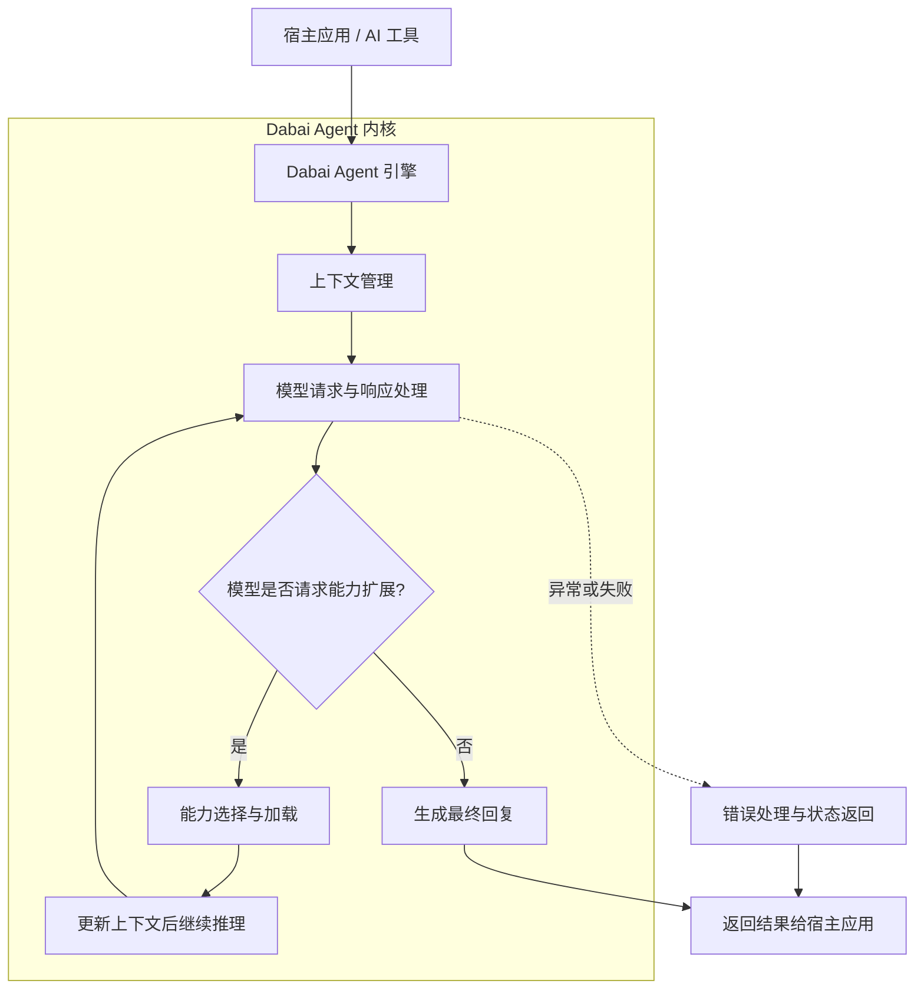
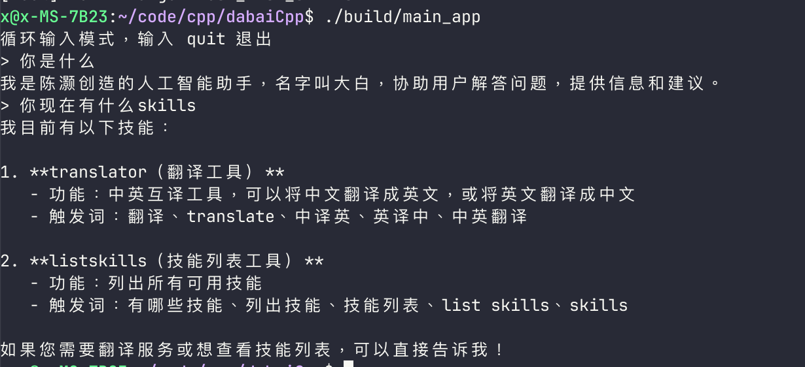

# Dabai Agent

`Dabai Agent` 是一个使用纯 C++ 实现的 AI Agent 引擎，以 `lib` 的形式被加载到我开发的各类 AI 工具中。

它不是一个独立的 AI 应用，而是一个可复用的底层引擎，负责承载模型调用、工具执行、流程编排和能力扩展。

## 核心定位

- 作为通用 AI Agent 引擎存在
- 以 `lib` 形式嵌入到不同 AI 工具中
- 为上层工具提供统一的执行、编排与扩展能力

## 当前能力

- 支持 Tool Use
- 支持 Skills 懒加载

## 架构图

## 说明

- 这张图主要展示 `Dabai Agent` 的整体工作方式，而不是具体实现细节
- 宿主应用接入引擎后，由引擎统一负责上下文管理、模型交互和能力扩展
- 当模型需要工具或 Skills 支持时，引擎会先补充相关能力，再继续完成后续推理
- 最终结果会回到宿主应用，形成一个可复用、可扩展的 Agent 执行闭环

## 适用方向

- 作为多个 AI 工具共享的底层引擎
- 为不同宿主工具复用同一套 Agent 能力
- 作为后续扩展更多工具能力与 Skills 机制的基础

## 运行展示

