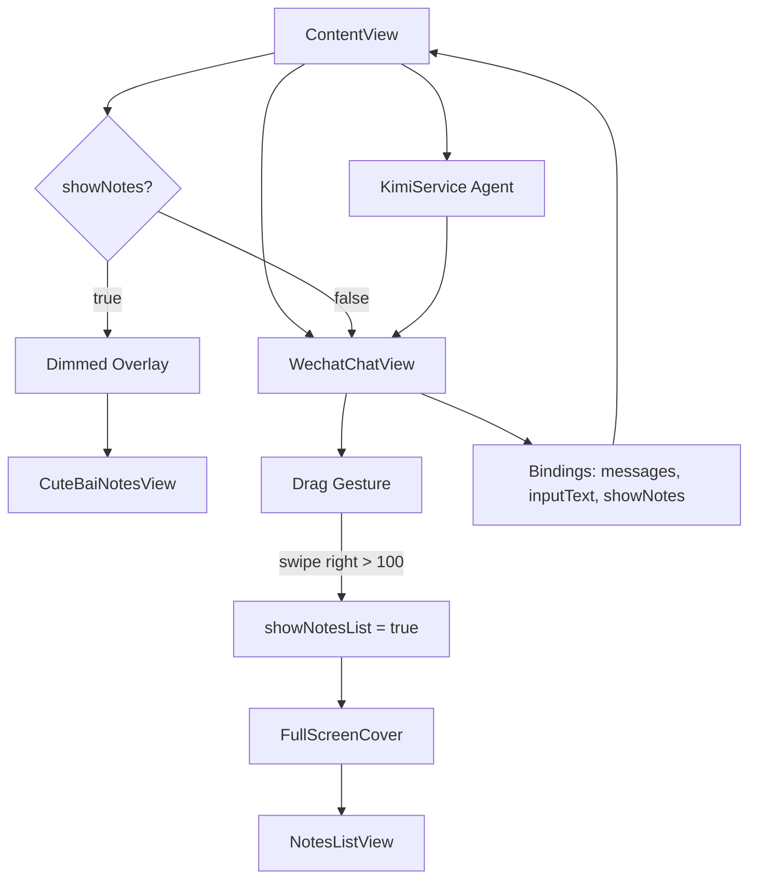

# ContentView Flow

## 简单逻辑说明
- `ContentView` 负责装配主界面，并持有聊天数据、输入状态与弹层开关。
- 右滑触发 `showNotesList`，通过 `fullScreenCover` 打开 `NotesListView`。
- 当 `showNotes` 为 `true` 时，显示半透明遮罩并弹出 `CuteBaiNotesView`，点击遮罩关闭。
- `KimiService` 作为 Agent 注入到 `WechatChatView`，负责记忆管理与 AI 笔记/对话能力。
- `KimiService` 负责将用户笔记归档到 SQLite，并基于检索进行对话与日常提醒；参考 OpenClaw 记忆设计：短期记忆为文本，长期记忆入库。
