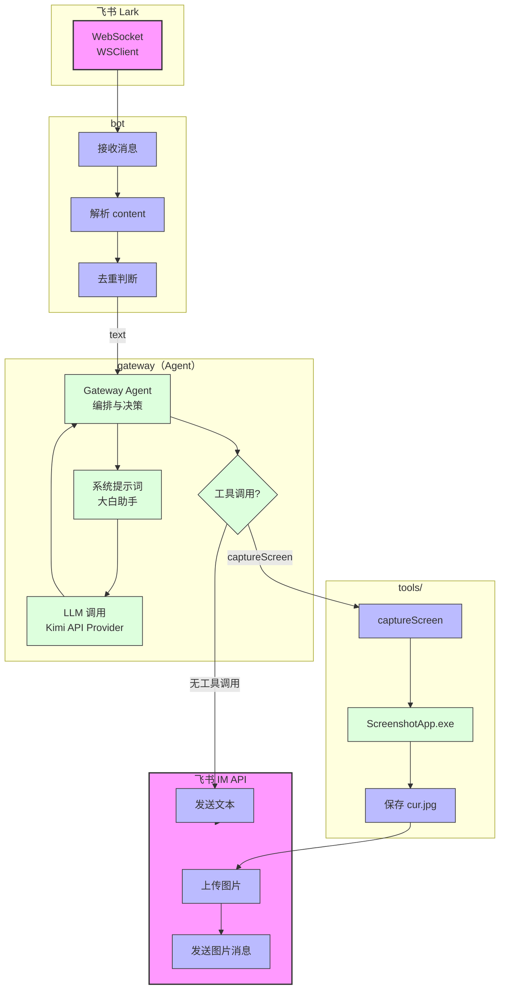

# Gateway Architecture: 截图例子

## 消息流程

1. **接收**: 飞书 WebSocket 接收用户消息
2. **解析**: bot.ts 解析 JSON content 提取 text
3. **Agent 处理**: gateway 作为 Agent 负责上下文、提示词、决策
4. **LLM 调用**: Agent 调用 Kimi 等 AI API 模型提供商获取回复
5. **判断**: Agent 判断是否需要工具，无工具→文本回复，有 captureScreen→截图
6. **响应**: 通过飞书 IM API 发送文本或图片
