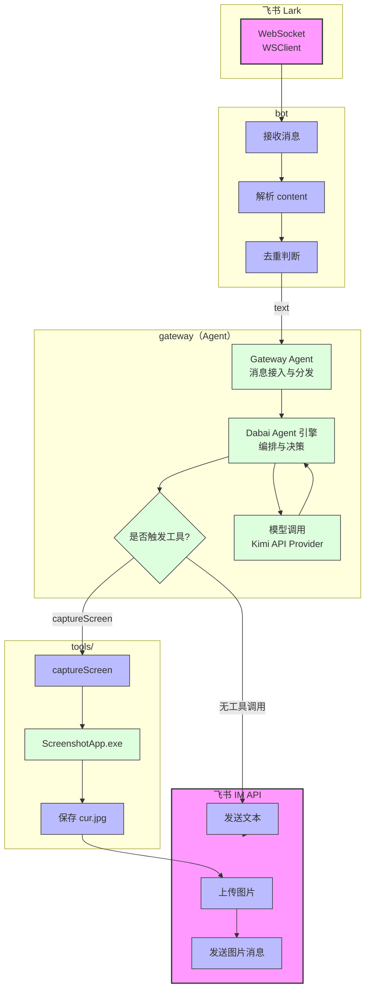

# Gateway Architecture: 截图例子

## 消息流程

1. **接收**: 飞书 WebSocket 接收用户消息
2. **解析**: bot.ts 解析 JSON content 提取 text
3. **引擎调用**: gateway 将请求交给 `Dabai Agent` 引擎处理
4. **模型交互**: `Dabai Agent` 负责与 Kimi 等模型提供商交互并完成推理
5. **工具判断**: 由 `Dabai Agent` 判断是否需要工具，无工具则返回文本，有 `captureScreen` 则进入截图流程
6. **响应**: 通过飞书 IM API 发送文本或图片
